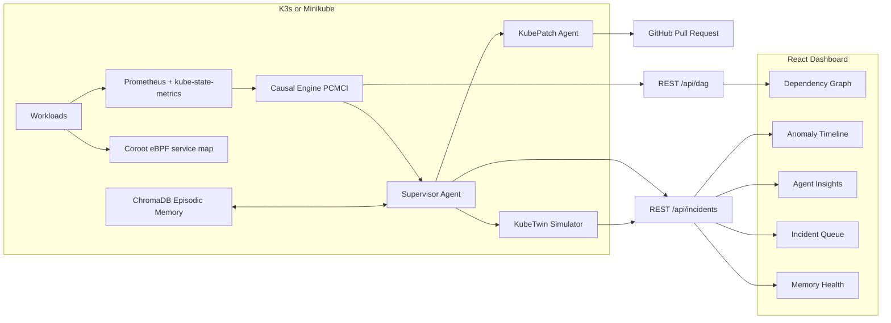
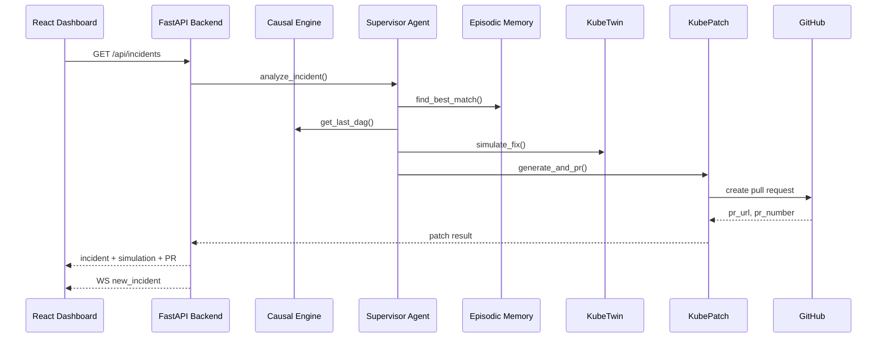

# KubeVision AI

KubeVision AI is an AI-powered, multi-agent AIOps platform for single-node Kubernetes clusters. It turns raw metrics into causal graphs, validates proposed fixes with an in-memory simulator, and can open GitHub pull requests for safe, human-approved remediation.

This repository includes the full end-to-end stack: telemetry ingestion, causal discovery, agent orchestration, episodic memory, simulation, YAML patching, and a real-time React dashboard.

## Table of Contents

- Overview
- Architecture
- Key Capabilities
- Repository Layout
- Requirements
- Quick Start (Local Dev)
- Cluster Deployment (K3s)
- API Reference
- API Contracts
- WebSocket Events
- Demo Workflow
- Configuration Reference
- Troubleshooting
- Security Notes
- Contributing
- License

## Overview

KubeVision AI closes the AIOps loop:

Detect -> Understand causality -> Simulate -> Create PR -> Learn from outcomes

It is designed for single-node clusters (Minikube or K3s) and aims to reduce hallucination risk by grounding all reasoning in live metrics, causal DAGs, and verified memory.

KubeVision AI prioritizes safe remediation. Every recommendation is simulated against the current cluster state before a PR is opened, and human approval remains mandatory for any changes applied to production.

## Architecture

### High-Level Flow



### Incident-to-PR Sequence



### Data and Control Path

1. Metrics and topology are captured in-cluster.
2. PCMCI generates a causal DAG and streams it to the frontend.
3. The Supervisor Agent correlates anomalies, DAG edges, and memory.
4. KubeTwin simulates proposed fixes and yields confidence.
5. KubePatch generates YAML and opens a PR when confidence is high.
6. Outcomes feed back into episodic memory.

### Component Responsibilities

- Prometheus + kube-state-metrics: source of pod CPU, memory, and restart telemetry.
- Coroot eBPF map: live dependency edges between services.
- Causal Engine (PCMCI): turns time-series telemetry into a causal DAG.
- Supervisor Agent: merges metrics, DAG, memory, and logs into a fix proposal.
- KubeTwin: simulates the proposed fix and returns confidence.
- KubePatch: generates YAML, opens PRs, and returns diffs.
- React Dashboard: presents the DAG, incidents, memory, and remediation actions.

## Key Capabilities

- Real-time causal DAGs (PCMCI) instead of correlation matrices.
- Multi-agent reasoning grounded in live evidence.
- Episodic memory with quality gates and decay.
- In-memory simulation gate before remediation.
- GitHub PR creation with human approval.

## Repository Layout

```
KubeVision/
	README.md
	kubevision-ai/
		.env.example
		backend/
		cluster/
		docker-compose.yml
		frontend/
		k8s/
		scripts/
```

## Requirements

- Docker
- kubectl
- Helm 3
- Node.js 18+
- Python 3.11+
- Git

You will also need:

- Mistral API key
- GitHub token with repo write access for PR creation

## Quick Start (Local Dev)

From the repo root:

```
cd kubevision-ai
cp .env.example .env
```

Install frontend dependencies and run the UI:

```
cd frontend
npm install
npm run dev
```

The dashboard is available at http://localhost:3000.

Run the backend locally:

```
cd kubevision-ai/backend
pip install -r requirements.txt
python -m uvicorn main:app --reload --port 8000
```

## Cluster Deployment (K3s)

Bootstrap K3s and install required Helm charts:

```
cd kubevision-ai
./cluster/k3s-install.sh
./cluster/helm-installs.sh
```

Build and deploy the backend:

```
docker build -t kubevision-backend:latest backend
kubectl apply -f k8s/kubevision-backend.yaml
kubectl apply -f k8s/causal-engine.yaml
kubectl apply -f k8s/memory-service.yaml
```

## API Reference

Error format

```json
{ "detail": "Human readable error" }
```

### GET /api/dag

Response

```json
{
	"timestamp": "2026-05-14T13:42:11Z",
	"edges": [
		{
			"source": "frontend",
			"target": "checkoutservice",
			"lag_seconds": 75,
			"causal_strength": 0.89,
			"causal_type": "memory_pressure"
		}
	]
}
```

Errors

- 500 Internal Server Error

Response

```json
{ "detail": "Internal Server Error" }
```

### GET /api/metrics/pods

Response

```json
{
	"namespace": "default",
	"generated_at": "2026-05-14T13:42:11Z",
	"pods": {
		"frontend": {
			"cpu_usage": 0.12,
			"cpu_limit": 1.0,
			"memory_working_set": 314572800,
			"memory_limit": 536870912,
			"oom_events": 0,
			"network_receive": 10800,
			"network_transmit": 21000,
			"restart_count": 0
		}
	},
	"history_window_minutes": 30,
	"history": {
		"frontend": [
			{ "timestamp": "2026-05-14T13:41:11Z", "metric": "memory_working_set", "value": 314572800 }
		]
	}
}
```

Errors

- 500 Internal Server Error

Response

```json
{ "detail": "Internal Server Error" }
```

### GET /api/incidents

Query parameters

- status: filter by incident status
- severity: filter by severity
- namespace: filter by namespace
- affected_pod: filter by pod name
- memory_path: filter by memory routing (fast, grounded, cold)
- limit: number of incidents returned (1 to 200, default 50)
- offset: zero-based offset (default 0)
- sort: asc or desc (default desc)

Response

```json
{
	"incidents": [
		{
			"id": "inc-7c2f",
			"created_at": "2026-05-14T13:40:02Z",
			"status": "pr_open",
			"severity": "high",
			"affected_pod": "frontend",
			"namespace": "default",
			"root_cause": "Memory pressure causing OOMKilled events",
			"causal_chain": ["frontend -> checkoutservice (75s, memory_pressure)"],
			"proposed_fix": { "memory_limit": "2Gi" },
			"confidence": 0.92,
			"memory_path": "cold",
			"memory_match_score": 0.12,
			"memory_case_id": null,
			"simulation_result": {
				"proposed_memory_limit": 2147483648,
				"observed_peak_bytes": 1879048192,
				"headroom_pct": 12.5,
				"fits_on_node": true,
				"resolves_oom": true,
				"confidence": 0.92,
				"downtime_expected": false
			},
			"pr_url": "https://github.com/org/repo/pull/47",
			"pr_number": 47
		}
	],
	"total": 24,
	"limit": 10,
	"offset": 0
}
```

Pagination and filtering examples

```
GET /api/incidents?status=pr_open&severity=high&limit=10&offset=0&sort=desc
GET /api/incidents?namespace=default&affected_pod=frontend&memory_path=cold
```

Errors

- 422 Unprocessable Entity

Response

```json
{ "detail": "limit must be between 1 and 200" }
```

### GET /api/incidents/{id}

Response

```json
{
	"id": "inc-7c2f",
	"status": "pr_open",
	"affected_pod": "frontend",
	"root_cause": "Memory pressure causing OOMKilled events",
	"confidence": 0.92,
	"simulation_result": {
		"headroom_pct": 12.5,
		"fits_on_node": true,
		"resolves_oom": true,
		"confidence": 0.92
	}
}
```

Errors

- 404 Not Found

Response

```json
{ "detail": "Incident not found" }
```

### POST /api/incidents/{id}/approve-pr

Response

```json
{
	"incident_id": "inc-7c2f",
	"status": "pr_approved",
	"pr_url": "https://github.com/org/repo/pull/47",
	"review_url": "https://github.com/org/repo/pull/47#pullrequestreview-123"
}
```

Errors

- 404 Not Found
- 409 Conflict
- 502 Bad Gateway

Response

```json
{ "detail": "Incident does not have an open PR to approve" }
```

### POST /api/simulate

Request

```json
{
	"pod_name": "frontend",
	"namespace": "default",
	"proposed_changes": { "memory_limit": "2Gi" }
}
```

Response

```json
{
	"pod_name": "frontend",
	"namespace": "default",
	"proposed_changes": { "memory_limit": "2Gi" },
	"simulation_result": {
		"proposed_memory_limit": 2147483648,
		"observed_peak_bytes": 1879048192,
		"headroom_pct": 12.5,
		"fits_on_node": true,
		"resolves_oom": true,
		"confidence": 0.92,
		"downtime_expected": false
	}
}
```

Errors

- 422 Unprocessable Entity
- 404 Not Found

Response

```json
{ "detail": "pod_name is required" }
```

### POST /api/debug/test-incident

Response

```json
{
	"id": "inc-7c2f",
	"status": "pr_open",
	"affected_pod": "frontend",
	"simulation_result": { "confidence": 0.92 },
	"pr_url": "https://github.com/org/repo/pull/47"
}
```

Errors

- 502 Bad Gateway

Response

```json
{ "detail": "KubePatch flow failed: <reason>" }
```

### POST /api/debug/seed-memory

Request

```json
{
	"affected_pod": "frontend",
	"root_cause": "Memory pressure causing OOMKilled events",
	"confidence": 0.92
}
```

Response

```json
{
	"incident_id": "demo-1a2b3c4d",
	"stored": true,
	"total_incidents": 7
}
```

Errors

- 404 Not Found

Response

```json
{ "detail": "Incident not found" }
```

### GET /api/memory/stats

Response

```json
{
	"total_incidents": 7,
	"fast_path_pct": 14.2,
	"grounded_path_pct": 42.0,
	"cold_path_pct": 43.8,
	"top_patterns": [
		{ "pattern": "OOMKilled exit code 137", "recall_count": 3 }
	]
}
```

Errors

- 500 Internal Server Error

Response

```json
{ "detail": "Internal Server Error" }
```

## API Contracts

```text
DagEdge {
	source: string
	target: string
	lag_seconds: number
	causal_strength: number
	causal_type: "cpu_pressure" | "memory_pressure" | "network_congestion" | "io_saturation"
}

DagData {
	timestamp: string | null
	edges: DagEdge[]
}

PodMetrics {
	cpu_usage: number
	cpu_throttled?: number
	cpu_limit?: number
	memory_working_set: number
	memory_limit?: number
	oom_events?: number
	network_receive: number
	network_transmit: number
	fs_reads?: number
	fs_writes?: number
	restart_count: number
}

SimulationResult {
	proposed_memory_limit: number | string
	observed_peak_bytes: number
	headroom_pct: number
	fits_on_node: boolean
	resolves_oom: boolean
	confidence: number
	downtime_expected: boolean
}

KubePatchResult {
	incident_id: string
	action: "pr_opened" | "manual_pr_required" | "manual_review_required" | string
	confidence: number
	current_yaml: string | null
	generated_yaml: string | null
	recommendation: string
	pr_url: string | null
	pr_number: number | null
	branch: string | null
	file_path: string | null
	label: string | null
	yaml_diff: string | null
}

Incident {
	id: string
	created_at: string
	status: "open" | "analyzing" | "fix_ready" | "pr_open" | "pr_approved" | "resolved" | string
	severity: "critical" | "high" | "medium" | "warning" | string
	affected_pod: string
	namespace: string
	root_cause: string
	causal_chain: string[]
	proposed_fix: object
	confidence: number
	memory_path: "fast" | "grounded" | "cold" | string
	memory_match_score: number
	memory_case_id: string | null
	simulation_result: SimulationResult | null
	pr_url: string | null
	pr_number: number | null
	kubepatch: KubePatchResult | null
}

IncidentsResponse {
	incidents: Incident[]
	total: number
	limit: number
	offset: number
}

MemoryStats {
	total_incidents: number
	fast_path_pct: number
	grounded_path_pct: number
	cold_path_pct: number
	top_patterns: { pattern: string; recall_count: number }[]
}

LiveMessage =
	| { type: "dag_update"; payload: DagData }
	| { type: "metric_update"; payload: { namespace: string; pods: Record<string, PodMetrics> } }
	| { type: "new_incident"; payload: Incident }
```

## WebSocket Events

- dag_update
- metric_update
- new_incident

## Demo Workflow

1. Start cluster services and deploy the backend.
2. Run the frontend locally.
3. Trigger a load spike and wait for an incident.
4. Walk through memory routing, simulation, and the PR gate.

Demo helpers:

- Bursty load test: kubevision-ai/scripts/stress-test.sh
- Demo narrative: kubevision-ai/scripts/demo-script.md

## Configuration Reference

Configure values in kubevision-ai/.env.

- MISTRAL_API_KEY
- GITHUB_TOKEN
- GITHUB_REPO
- PROMETHEUS_URL
- CHROMA_PERSIST_DIR
- KUBECONFIG
- MEMORY_QUALITY_THRESHOLD
- MEMORY_DECAY_RATE
- SIMULATION_CONFIDENCE_AUTO_PR
- SIMULATION_CONFIDENCE_LOW

## Troubleshooting

- If the dashboard shows no data, ensure port-forwarding to the backend service.
- If incidents never appear, confirm Prometheus is scraping and the causal engine is running.
- If PR creation fails, verify GITHUB_TOKEN and repo permissions.
- If simulation confidence is zero, confirm metrics include memory limits and working set.

## Security Notes

- Do not commit API keys or GitHub tokens.
- Use least-privilege tokens for PR creation.
- Treat incident data as sensitive operational telemetry.

## Contributing

Contributions are welcome. Please open an issue describing the change and include reproduction steps for any bug fixes.

## License

No license has been specified yet.
